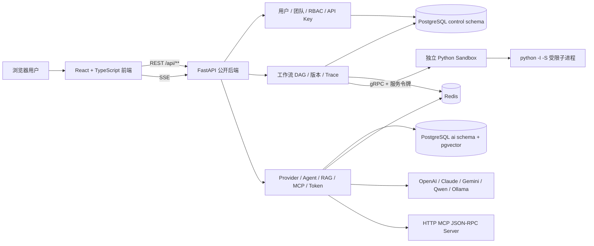

# FlowAI Studio 项目详细介绍

> 一套面向 AI 应用开发、工作流编排和工程实践的可视化低代码平台。
>
> 当前版本采用 React + Python FastAPI + PostgreSQL/pgvector + Redis，实现了从工作流设计、执行、调试、版本管理，到 RAG、Agent、MCP、权限、追踪和成本统计的完整主链路。

## 1. 项目概述

FlowAI Studio 的目标不是再做一个简单的“聊天机器人页面”，而是把 AI 应用背后的提示词、模型调用、知识检索、工具调用、条件判断和输出处理，统一抽象为可视化、可保存、可追踪、可复用的工作流。

用户可以在画布中组合八类节点，形成一张有向无环图。平台负责校验图结构、调度节点、维护运行状态，并通过 SSE 实时返回节点状态、Agent Trace、心跳和最终结果。围绕工作流，系统还提供用户与团队、应用、API Key、分享、模板、版本、Trace、RAG 知识库、MCP 工具、Token 用量和限流监控等能力。

一句话概括：

**FlowAI Studio 是一个以“显式工作流 DAG”为核心、兼顾 Agent 与 RAG 的全栈 AI 应用编排平台。**

## 2. 项目背景

### 2.1 AI 应用开发的常见问题

传统 AI Demo 往往把模型调用、提示词拼接和业务逻辑写在同一个接口中。随着需求扩展，会快速出现以下问题：

1. 提示词、检索、模型和工具逻辑耦合，修改成本高。
2. 执行过程不可见，发生错误时难以判断是检索、模型还是工具调用失败。
3. 缺少版本、Trace、权限和成本统计，只能演示，难以形成完整工程闭环。
4. Agent 的自主决策具有不确定性，不适合直接替代所有确定性业务流程。
5. 不同模型 Provider 的协议、鉴权和 Token 用量格式不一致。
6. 文档解析、切片、Embedding、全文检索和重排需要独立的数据处理链路。
7. 用户代码执行具有安全风险，不能直接放在 Web 进程中运行。

### 2.2 项目要解决的问题

FlowAI Studio 将 AI 应用拆分为三个层次：

- **应用层**：用户、团队、权限、应用、模板、版本、分享和 API Key。
- **编排层**：工作流 DSL、DAG 调度、条件分支、重试、超时、取消、SSE 和 Trace。
- **AI 能力层**：模型 Provider、Agent、RAG、文档处理、MCP、Skill 和 Token 统计。

这种拆分让确定性的业务流程由平台 DAG 控制，把模型的不确定性限制在 LLM、Agent 等具体节点内部。

## 3. 目标用户与使用场景

### 3.1 目标用户

- 希望快速搭建 AI 应用原型的开发者。
- 需要理解 AI 工作流平台内部实现的学习者。
- 需要展示完整全栈、数据、调度和 AI 工程能力的作品集作者。
- 希望用可视化方式管理提示词、RAG 和工具调用的小型团队。

### 3.2 典型场景

- 企业知识库问答：上传 PDF、DOCX、Markdown 或 TXT，通过 RAG 节点检索后交给模型回答。
- 智能客服：用 Condition 节点判断问题类型，再路由到不同知识库或 Agent。
- 内容生成：通过多个 LLM 节点完成提纲、初稿、审核和输出。
- 数据处理：使用 Python Skill 节点执行受限计算，再把结果传递给后续节点。
- 多角色协作：团队成员以 owner、admin、editor、viewer 角色共同管理应用。
- 调试与审计：通过 SSE、执行记录、Trace 和 Span 查看每个节点的输入、输出、耗时和错误。

## 4. 总体架构



### 4.1 进程边界

当前版本保持三个主要运行进程：

1. React/Vite 前端，默认端口 `5173`。
2. FastAPI 公开后端，默认端口 `3001`。
3. Python gRPC sandbox，默认端口 `50052`，只监听 loopback。

PostgreSQL/pgvector 和 Redis 运行在 WSL 中。本地开发不依赖 Docker，前端只访问 FastAPI，不直接访问数据库、Redis 或 sandbox。

### 4.2 为什么最终采用全 Python 后端

项目曾评估“Go 控制面 + Python AI 执行面”，最终选择全 Python，原因是：

- 当前规模没有独立扩缩容和多语言团队的现实需求。
- 用户、工作流、AI 与数据链路需要频繁共享类型和上下文，跨服务 gRPC 会增加重复 DTO、错误映射和部署成本。
- Provider、文档解析、Embedding、Agent 和 AI 工具生态以 Python 为主。
- 单一 FastAPI 后端更适合本地演示、课程项目和快速迭代。
- 真正需要隔离的用户代码仍保留为独立 gRPC sandbox，没有把危险执行放回 Web 进程。

该方案不是否定 Go，而是基于当前业务规模做出的最小复杂度选择。未来只有在出现明确的独立扩缩容、团队边界或吞吐瓶颈时，才值得重新拆分服务。

## 5. 技术栈

| 层次 | 技术 | 主要用途 |
|---|---|---|
| 前端 | React 18、TypeScript | 页面、状态和交互开发 |
| 构建 | Vite 5 | 开发服务器、代理和生产构建 |
| UI | Ant Design、Ant Design Charts | 表单、表格、布局、统计图表 |
| 工作流画布 | React Flow / `@xyflow/react` | 节点画布、连线和拖拽编排 |
| 前端状态 | Zustand | 用户、应用、工作流、RAG、团队等状态管理 |
| HTTP/SSE | Axios、Fetch、eventsource-parser | REST 请求和流式事件解析 |
| Web 后端 | Python 3.13、FastAPI | 公开 API、依赖注入、SSE、OpenAPI |
| 数据校验 | Pydantic v2 | 请求模型、配置和严格字段校验 |
| 数据访问 | SQLAlchemy 2、psycopg 3 | PostgreSQL 异步访问和参数化 SQL |
| 数据迁移 | Alembic | `control`、`ai` schema 初始化与演进 |
| 主数据库 | PostgreSQL 16 | 用户、团队、工作流、执行、Trace 和 AI 数据 |
| 向量能力 | pgvector 0.8.5 | 保存文档块 Embedding |
| 关键词检索 | PostgreSQL FTS、Python BM25 | 全文候选召回和关键词重排 |
| 缓存与状态 | Redis 7 | 运行状态、取消标志、令牌桶、缓存和临时状态 |
| 内部协议 | gRPC、Protobuf | FastAPI 与独立 sandbox 通信 |
| 文档解析 | pypdf、zipfile、ElementTree | PDF、DOCX、TXT、Markdown 解析 |
| 密码与令牌 | pwdlib Argon2、PyJWT、HMAC-SHA256 | 密码哈希、JWT、API Key 摘要 |
| Python 依赖 | uv | 锁定、同步和运行 Python 环境 |
| 测试 | pytest、Node Test Runner、PowerShell、Playwright | 单元、契约、集成和浏览器验收 |

## 6. 关键技术选型

### 6.1 FastAPI，而不是继续使用 NestJS

FastAPI 与 Pydantic 对 Python AI 生态的适配更直接。模型 Provider、RAG、Agent、文档处理和 sandbox 客户端可以共享 Python 类型与异步运行时，减少跨语言序列化和重复实现。

同时，FastAPI 自动生成 OpenAPI，适合保留原有 `/api/**` 接口并快速建立契约测试。

### 6.2 PostgreSQL + pgvector，而不是 MySQL + 外部向量库

项目既有强关系数据，也有 JSON DSL、全文检索和向量字段：

- 用户、团队、应用、权限适合关系模型和事务。
- 工作流节点、边和变量适合 JSONB。
- RAG 需要 FTS 和向量字段。
- Trace、Span、版本和执行记录需要可靠排序与查询。

PostgreSQL 可以在一个数据系统内覆盖关系、JSON、FTS 和 pgvector，避免再引入独立 Elasticsearch 或向量数据库。当前规模下，这比多套数据基础设施更合理。

### 6.3 Redis 只保存短期状态

PostgreSQL 保存最终业务事实，Redis 保存：

- 运行中的工作流状态。
- 取消标志和运行集合。
- 登录失败与锁定状态。
- Redis Lua 令牌桶。
- L2 缓存和短期运行数据。

这样可以避免把业务最终状态只放在易失缓存中，也为后续多实例部署保留基础。

### 6.4 自研平台 DAG，而不是让 Agent 框架接管工作流

平台工作流需要确定性：节点是否执行、何时汇合、条件分支如何剪枝、失败是否重试，都应当由显式图结构控制。

因此平台使用自研 DAG 调度器，核心机制包括：

- 拓扑和环检测。
- 运行时父节点集合与就绪队列。
- 汇合节点等待全部有效前驱完成。
- Condition 节点对未选分支递归剪枝。
- 节点和工作流超时。
- 指数退避重试。
- Redis 取消标志。
- 执行期间心跳。

Agent 只负责单个 Agent 节点内部的模型决策和 Trace，不替代平台 DAG。

### 6.5 SSE，而不是 WebSocket

工作流执行是典型的服务端单向事件流。SSE 具有以下优势：

- 基于普通 HTTP，代理和调试更简单。
- 浏览器 Fetch 流可直接消费。
- 自动适配文本事件和 JSON 数据。
- 断线、终止和心跳语义容易约束。

平台固定六类事件：`workflow_start`、`node_status`、`agent_trace`、`heartbeat`、`done`、`error`。每次运行只允许一个终止事件，并且终止后不得再发送其他事件。

### 6.6 gRPC 只用于 sandbox

业务模块都在同一个 FastAPI 进程内，直接函数调用更简单。用户代码执行具有明确的隔离价值，因此 sandbox 保留独立进程和 Protobuf 协议。

内部 gRPC 使用随机服务令牌，sandbox 只监听本机地址，前端无法直接调用。

## 7. 核心功能模块

### 7.1 可视化工作流

平台固定支持八类节点：

| 节点 | 作用 | 执行位置 |
|---|---|---|
| Start | 初始化变量和运行上下文 | 平台 DAG |
| UserInput | 从输入中读取字段 | 平台 DAG |
| LLM | 调用指定模型生成结果 | AI 模块 |
| RAG | 查询知识库并返回上下文 | AI 模块 |
| Agent | 执行单 Agent 或 Supervisor/Worker 状态流程 | AI 模块 |
| Skill | 调用计算器或受限 Python | AI 模块 + sandbox |
| Condition | 判断条件并选择分支 | 平台 DAG |
| Output | 渲染最终输出 | 平台 DAG |

工作流可保存为 JSON DSL，包含节点、边、变量、版本和应用归属。导入时兼容旧 `user-input` 类型，内部统一为 `userInput`。

### 7.2 用户、团队与 RBAC

权限设计分为三层：

- 全局角色：`admin`、`member`。
- 团队角色：`owner`、`admin`、`editor`、`viewer`。
- 团队应用授权：`full_access`、`can_edit`、`can_view`。

应用授权会进一步映射为 `app:read`、`app:update`、`workflow:execute` 等权限。服务端每个受保护接口都根据资源所有权、团队角色和应用授权做判断，而不是只依赖前端隐藏按钮。

### 7.3 API Key 与分享

API Key 使用 256 位随机材料，完整明文只在创建时返回一次。数据库只保存：

- HMAC-SHA256 摘要。
- 可展示的前缀。
- scopes、状态、过期时间和应用归属。

删除应用时，应用级 API Key 通过数据库外键级联撤销，避免失去归属后意外变成更宽泛的用户级 Key。

应用分享支持公开链接、公开状态、访问统计和 Embed 配置，并保留前端需要的兼容字段。

### 7.4 版本、执行与 Trace

工作流支持版本快照、Diff、发布和回滚。每次执行会写入：

- `workflow_executions`：执行状态、输入、上下文、错误和总耗时。
- `traces`：一次完整链路。
- `spans`：单个节点的类型、状态、输出、错误和耗时。

前端提供 Trace 列表和详情页面，使工作流不仅“能运行”，还可以解释“运行了什么”。

### 7.5 模型 Provider

Provider 层统一处理 OpenAI、Claude、Gemini、Qwen 和 Ollama。路由逻辑根据模型 ID 选择 Provider，并统一输出内容、模型、Provider、输入 Token 和输出 Token。

外部 Provider 依赖对应 API Key；Ollama 用于本地模型。未配置 Provider 时，健康检查和其他非模型功能仍可运行，但真实 LLM/Agent 生成会返回明确配置错误。

### 7.6 Agent

Agent 模块提供单 Agent 和 Supervisor/Worker 两种状态表达，并产生统一 Trace：

- `thinking`
- `tool_call` / `tool_result`
- `rag_retrieve`
- `worker_delegate` / `worker_result`
- `final_answer`
- `error`

当前实现使用轻量 Python 状态逻辑，不把 LangGraph 作为运行依赖。这样减少本地依赖和框架耦合，同时保留 Agent Trace 与工作流集成接口。

### 7.7 RAG

RAG 链路包括：

1. 创建知识库并配置切片、检索和 Embedding 参数。
2. 上传 TXT、Markdown、PDF 或 DOCX。
3. 后台解析和分块。
4. Provider 可用时生成 Embedding 并写入 pgvector。
5. PostgreSQL FTS 生成关键词候选。
6. Python 使用标准 BM25 公式重排。
7. 使用 RRF 融合关键词排序结果。

当 Ollama 或外部 Embedding Provider 不可用时，文档仍会以 `NULL` 向量完成入库，FTS + BM25 路径可以继续运行。该降级设计保证本地项目不会因为缺少模型服务而完全无法演示 RAG。

### 7.8 MCP

当前版本支持 HTTP MCP JSON-RPC：

- MCP Server 配置 CRUD。
- 连接与断开。
- `tools/list` 工具发现。
- `tools/call` 工具调用。
- 已连接工具目录聚合。

为了满足本机无 Docker、Web 主进程不执行用户命令的边界，当前版本没有启用 MCP stdio 命令执行。

### 7.9 Python sandbox

sandbox 是独立 Python gRPC 服务。它启动 `python -I -S` 子进程，并通过以下方式限制代码：

- AST 拒绝 import、class、私有名称和私有属性。
- 只暴露经过挑选的 builtins。
- 禁止 `open`、`eval`、`exec`、`compile`、`__import__` 等用户入口。
- 以参数数组启动进程，不使用 `shell=True`。
- 限制源码大小、运行时间和输出大小。
- Web 后端本身不调用 `exec` 或 `subprocess` 执行用户代码。

这是适合 Windows 本地演示的受限执行器，但它不等同于容器、虚拟机或 WASI 的操作系统级隔离。生产环境应替换为容器、微型虚拟机或专门的 sandbox 基础设施。

### 7.10 Token、限流和缓存

- Token 用量以内存缓冲方式收集，达到 100 条或每 10 秒批量落库，关闭时强制 flush。
- Redis Lua 脚本实现令牌桶，避免普通读改写造成并发竞态。
- 缓存采用 L1 有界 LRU + L2 Redis，并加入 TTL 抖动，降低同一时刻批量失效概率。
- 提供限流配额、缓存统计和熔断状态查看/重置接口。

## 8. 数据架构

PostgreSQL 使用两个 schema，但由同一个 Python 后端统一负责：

### 8.1 `control` schema

- 用户、应用、团队、成员、团队应用授权。
- API Key、分享配置。
- 工作流、版本、模板和评分。
- 执行记录、Trace、Span。

### 8.2 `ai` schema

- 会话、消息、Token 用量。
- 知识库、文档、文档块和 Embedding。
- MCP Server 和 Skill。

当前数据库共有七个 Alembic revision。项目没有需要保留的旧生产数据，因此采用全新数据库初始化，不编写 Prisma 历史数据转换程序。

## 9. API 与契约设计

所有公开接口保持 `/api/**` 路径，并使用统一响应：

```json
{
  "success": true,
  "code": "SUCCESS",
  "message": "success",
  "data": {},
  "timestamp": "2026-07-16T00:00:00.000Z"
}
```

项目冻结了 112 条公开路由作为兼容基线。Python 测试会读取这份基线并验证 FastAPI 实际注册路由包含全部契约，避免后端重构导致前端静默失效。

契约还覆盖：

- 八类工作流节点。
- DSL 1.0。
- 响应包装字段顺序。
- 六类 SSE 事件。
- 成功和失败事件顺序。
- 终止事件唯一性。

## 10. 安全设计

当前已实现的安全措施包括：

- Argon2 密码哈希。
- JWT 过期时间和服务端用户复核。
- Redis 登录失败计数和临时锁定。
- API Key HMAC-SHA256 摘要存储。
- 参数化 SQL 和 Pydantic 严格输入模型。
- 服务端 RBAC，不把前端权限判断当作安全边界。
- sandbox 独立进程、loopback gRPC 和服务令牌。
- MCP 只支持 HTTP，不允许主进程直接执行 stdio 命令。

当前前端为了本地项目便利，仍使用浏览器存储保存 Bearer Token。若进入生产环境，应迁移到 HttpOnly、Secure、SameSite Cookie，并补充 CSRF、CSP、HTTPS 和密钥管理。

## 11. 竞品分析

调研时间：2026-07-16。以下比较基于各产品官方主页和官方文档，不以营销口号替代实际定位。

| 产品 | 官方定位与强项 | 相比 FlowAI Studio 的优势 | FlowAI Studio 的差异 |
|---|---|---|---|
| Dify | 生产级 Agentic Workflow 平台，覆盖工作流、RAG、Agent、模型、插件、发布和观测 | 产品成熟度、插件市场、知识流水线、企业部署和治理更强 | 架构更小、更适合学习和二次开发；平台 DAG、契约迁移和本机原生运行过程更透明 |
| Flowise | 面向 AI Agent 与 LLM Workflow 的开源可视化平台，提供 Assistant、Chatflow、Agentflow | 组件、模型、向量库、数据源、评估和 MCP 生态更丰富 | 固定八节点 DSL 和业务域接口更易理解；用户、团队、版本、Trace 与 API 兼容故事更集中 |
| Langflow | Python 低代码 Agent/RAG Builder，强调自定义组件、Playground、API 和 MCP Client/Server | Python 组件扩展和 MCP 完整度更高，与主流 AI 库结合更成熟 | 不依赖大型 Agent 框架控制平台 DAG，适合展示调度、权限、数据库和 SSE 的底层实现 |
| n8n | 面向技术团队的通用业务自动化平台，拥有 400+ 集成并加入 AI Agent 能力 | 业务连接器、触发器、人工审批、环境管理和生产自动化更强 | 更聚焦 AI 应用生命周期、RAG、模型、Agent Trace 和知识库，而不是通用 SaaS 自动化 |

### 11.1 与 Dify 的关系

Dify 是最接近“完整 AI 应用平台”的竞品。它已经覆盖 Cloud、VPC、自托管、知识流水线、插件、评估和企业治理。FlowAI Studio 不应宣称在产品成熟度上超过 Dify。

FlowAI Studio 的价值在于把核心机制控制在可理解范围内：开发者可以直接阅读 DAG、SSE、RBAC、RAG、Token 和 sandbox 代码，适合作为教学项目、作品集和定制化基础。

### 11.2 与 Flowise、Langflow 的关系

Flowise 和 Langflow 更强调组件生态和快速搭建。FlowAI Studio 的节点数量更少，扩展性不如它们，但固定 DSL 降低了理解成本，也让契约测试、版本 Diff、权限和执行追踪更容易形成统一规范。

### 11.3 与 n8n 的关系

n8n 的核心优势是通用业务连接器和自动化，不是单纯 AI 编排。FlowAI Studio 更适合围绕模型、知识、Agent 和 AI 应用发布构建产品；涉及大量 SaaS 连接、定时任务、审批和企业系统联动的场景，n8n 更成熟。

### 11.4 项目定位结论

FlowAI Studio 最合理的定位不是“替代 Dify/n8n”，而是：

**一个可解释、可验证、便于二次开发的轻量 AI 工作流平台实现。**

## 12. 项目亮点

### 12.1 从旧后端到全 Python 的契约式迁移

项目不是删除旧代码后重写几个接口，而是先冻结 Controller、前端调用、DSL 和 SSE 契约，再用 FastAPI 覆盖全部公开路由。最终删除 Go、NestJS、Prisma 和 Docker 运行要求，同时保持前端功能不需要整体重写。

这体现了真实工程中的迁移能力：先定义不变量，再替换内部实现。

### 12.2 确定性 DAG 与非确定性 Agent 分层

平台没有让 Agent 决定全部流程，而是用 DAG 控制业务路径，把 Agent 限制在节点内部。这个设计兼顾了 AI 灵活性和业务可控性，也更容易解释失败、重试和权限边界。

### 12.3 算法不是名称包装

- 限流使用 Redis Lua 令牌桶。
- 关键词检索使用真实 BM25 公式。
- 分支执行使用拓扑依赖和递归剪枝。
- Token 用量使用阈值 + 定时批量写入。
- 缓存包含有界 L1、Redis L2 和 TTL 抖动。

### 12.4 完整工程闭环

项目不仅有画布和模型调用，还覆盖用户、团队、权限、API Key、分享、模板、版本、Trace、成本和限流监控，使其更接近真实平台而不是单页 Demo。

### 12.5 本地无 Docker 可运行

通过 Windows Python + WSL PostgreSQL/Redis 的方式，项目可以在没有 Docker Desktop 的电脑上运行。环境检查、数据库初始化、启动、停止和健康检查均有 PowerShell 脚本。

### 12.6 可验证的质量证据

最终验收结果：

- Python backend：8 项 pytest 通过。
- Python sandbox：6 项 pytest 通过。
- HTTP、DSL、SSE 契约：17 项通过。
- Protobuf/sandbox 契约：4 项通过。
- 本机架构、schema、进程契约：6 项通过。
- 共计 41 项自动化测试通过。
- 身份、应用、团队、API Key、分享完成真实 HTTP 集成验证。
- 工作流 SSE 实际执行并以唯一 `done` 终止。
- Python Skill 实际通过 sandbox 返回结果。
- TXT RAG 实际完成上传、切片和检索。
- MCP 实际完成工具发现和调用。
- 前端 TypeScript + Vite 生产构建成功。
- Playwright 实际完成注册、登录和应用页面访问。

## 13. 项目局限

为了避免把项目介绍写成不可信的包装，当前限制需要明确说明：

1. 外部 LLM 和 Embedding 需要 API Key 或本地 Ollama。
2. 当前 RAG 本地可验证路径以 FTS + BM25 为主；完整语义向量召回和第三方 Reranker 仍可继续增强。
3. MCP 当前只支持 HTTP JSON-RPC，不支持 stdio transport。
4. Windows native sandbox 没有容器或微型虚拟机级的 CPU、内存和内核隔离。
5. 限流和缓存已经可用，但自动熔断状态迁移和分布式互斥能力仍可深化。
6. 前端仍有既有 lint warnings，生产 bundle 也有进一步拆包空间。
7. 当前面向本地和演示环境，没有 Kubernetes、多区域部署和生产级灾备。
8. 项目没有历史生产数据，因此不包含 Prisma 到 Alembic 的数据迁移工具。

这些限制不影响当前版本作为完整本地项目运行，但决定了它与成熟商业平台之间的差距。

## 14. 后续演进路线

### 第一阶段：增强当前单体

- 增加真实 pgvector 查询与语义/关键词加权融合。
- 接入 Cohere 或 Ollama Reranker，并保留失败降级。
- 完成自动 closed/open/half-open 熔断状态迁移。
- 为 L1/L2 缓存增加空值缓存和 Redis 互斥锁。
- 前端路由懒加载和图表模块拆包。

### 第二阶段：完善 Agent 与评估

- 增加可配置工具循环和明确的最大迭代次数。
- 引入 Agent 数据集、评估指标和回归测试。
- 支持人工确认节点和高风险工具审批。
- 增加 Prompt/模型 A/B 测试。

### 第三阶段：提升隔离与部署

- 将 native sandbox 替换为容器、WASI 或微型虚拟机。
- 增加 HTTPS、HttpOnly Cookie、CSRF 和集中密钥管理。
- 引入队列 worker 和多实例运行状态恢复。
- 在出现真实部署需求后再增加 Docker/Kubernetes，而不是提前引入。

## 15. 项目目录

```text
aiflow-studio/
├─ flowai-studio-frontend/     React/TypeScript 可视化前端
├─ flowai-studio-backend/      唯一公开 FastAPI 后端
│  ├─ src/aiflow_runtime/api/  HTTP/SSE 接口
│  ├─ src/aiflow_runtime/ai/   Provider、Agent、RAG、Skill
│  ├─ src/aiflow_runtime/workflow/ DAG、DSL、执行状态
│  ├─ src/aiflow_runtime/identity/ 认证与 RBAC
│  ├─ src/aiflow_runtime/infrastructure/ 数据库、Redis、缓存、限流
│  └─ alembic/                 数据库迁移
├─ flowai-studio-sandbox/      独立 Python gRPC sandbox
├─ proto/                      sandbox Protobuf 与 Python 生成代码
├─ contracts/                  HTTP、DSL、响应和 SSE 契约
├─ scripts/native/             Windows 原生启动与验收脚本
└─ docs/                       设计、计划和项目文档
```

## 16. 本地启动

### 16.1 环境要求

- Windows
- Python 3.13
- uv
- Node.js 20
- WSL
- PostgreSQL 16 + pgvector 0.8.5
- Redis 7

### 16.2 初始化数据库

```powershell
powershell -NoProfile -ExecutionPolicy Bypass -File scripts/native/initialize-database.ps1
```

### 16.3 启动后端和 sandbox

```powershell
powershell -NoProfile -ExecutionPolicy Bypass -File scripts/native/start-services.ps1
powershell -NoProfile -ExecutionPolicy Bypass -File scripts/native/check-services.ps1
```

### 16.4 启动前端

```powershell
cd flowai-studio-frontend
npm install
npm run dev
```

### 16.5 停止服务

```powershell
powershell -NoProfile -ExecutionPolicy Bypass -File scripts/native/stop-services.ps1
```

## 17. 面试与作品集表述

可以将项目概括为：

> 我实现了一个 React + FastAPI 的 AI 低代码工作流平台。平台用自研 DAG 调度八类节点，通过运行时依赖集合处理汇合节点，通过递归可达性分析剪枝条件分支，并用 SSE 返回节点状态、Agent Trace、心跳和唯一终止事件。后端还实现了三级 RBAC、版本与 Trace、Provider 适配、RAG、MCP、Token 批量统计和独立 Python sandbox。数据层使用 PostgreSQL 的关系、JSONB、FTS 和 pgvector，Redis 保存取消状态、令牌桶和缓存。项目从旧的多语言方案迁移到全 Python，同时用 112 条冻结路由和前端契约保证兼容。

最值得展开的技术问题包括：

- 为什么平台 DAG 不能直接交给 Agent 框架。
- 条件分支剪枝如何避免错误跳过汇合节点。
- 为什么 API Key 只保存 HMAC 摘要。
- SSE 如何保证终止事件唯一性。
- 为什么 PostgreSQL 同时承担关系、FTS 和向量数据。
- 无 Docker 条件下如何隔离 Python 代码，以及这种方案的安全上限。
- 如何在大规模重写时通过契约测试保护前端。

## 18. 竞品资料来源

- Dify 官方主页：[The Platform for Production-Ready Agentic Workflows](https://dify.ai/)
- Dify GitHub：[langgenius/dify](https://github.com/langgenius/dify)
- Dify 自托管文档：[Deploy Dify with Docker Compose](https://docs.dify.ai/en/self-host/deploy/quick-start/docker-compose)
- Flowise 官方文档：[Introduction](https://docs.flowiseai.com/)
- Flowise 官方主页：[Build AI Agents, Visually](https://flowiseai.com/)
- Langflow 官方主页：[Low-code AI builder for agentic and RAG applications](https://www.langflow.org/)
- Langflow MCP 文档：[Use Langflow as an MCP server](https://docs.langflow.org/mcp-server)
- n8n AI 官方页：[Advanced AI Workflow Automation](https://n8n.io/ai/)
- n8n 功能页：[Workflow Automation Features](https://n8n.io/features/)

---

FlowAI Studio 当前最有价值的地方，不是堆叠了多少 AI 名词，而是把可视化编排、确定性调度、AI 能力、数据、权限、观测和迁移验证放在了同一个可运行、可解释的工程中。
