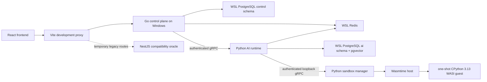

# FlowAI Studio Go + Python Backend Migration Design

**Date:** 2026-07-13

**Status:** Approved migration design, revised for the native local runtime

## 1. Goal

Replace the NestJS monolith with a Go control plane, a Python AI runtime, and a Python WASI sandbox while preserving the React frontend, the public `/api/**` surface, response envelopes, SSE behavior, and all frontend-visible product capabilities.

The final runtime stack is React/TypeScript + Go + Python. NestJS, Prisma, `vm2`, the Node backend runtime, and the legacy Compose file are removed only after compatibility and end-to-end acceptance are proven.

### 1.1 Local Runtime Decisions

The user selected a native local development model after the original design was written:

- Go 1.26 and Python 3.13 run as native Windows processes.
- PostgreSQL 16 with pgvector and Redis 7 run in the existing WSL environment and are reached through `127.0.0.1`.
- Docker and Docker Compose are not runtime or test dependencies.
- PostgreSQL remains the database because the target RAG design requires pgvector and PostgreSQL full-text search; the installed MySQL instance is not used by the migration.
- Python code nodes run inside a CPython 3.13 WASI guest hosted by Wasmtime. The Go and native Python processes never execute user code directly.

## 2. Current-State Evidence

The design is based on the current worktree, including the user's staged changes, rather than only `main`.

- The repository currently contains `flowai-studio-backend/` and `flowai-studio-frontend/`; the new Go, Python, sandbox, and Protobuf directories do not exist yet.
- TypeScript AST inspection finds 112 public NestJS controller endpoints under the global `/api` prefix.
- The frontend uses eight workflow node types: `start`, `userInput`, `llm`, `rag`, `skill`, `condition`, `output`, and `agent`.
- Workflow DSL version `1.0` uses `kind: Workflow` with `metadata` and `spec.nodes`, `spec.edges`, and optional `spec.variables`.
- The workflow executor uses BFS-style scheduling, `runtimeInDegree`, recursive condition-branch pruning, timeout, retry, cancellation, heartbeat, trace, and SSE events.
- The current response interceptor returns `{success, code, message, data, timestamp}`. Error responses add `path` and use stable codes such as `BAD_REQUEST`, `UNAUTHORIZED`, `FORBIDDEN`, `NOT_FOUND`, `CONFLICT`, `VALIDATION_ERROR`, `RATE_LIMIT`, and `INTERNAL_ERROR`.
- The current worktree is not a green executable baseline: backend build reports 118 TypeScript errors, 10 of 17 Jest suites fail to compile, and the frontend build fails because chart packages and `AgentTraceStep` are unavailable.

The migration therefore preserves intended public behavior, not accidental breakage. Compatibility fixtures must record which source established each contract: controller, DTO, frontend call site, frontend type, SSE parser, or observed legacy response.

## 3. Contract Conflict Rules

When the existing sources disagree, resolve them in this order:

1. Explicit requirements in the migration goal and acceptance plan.
2. Frontend-visible behavior required for an existing feature to work.
3. Existing public controller route, status, and response behavior.
4. Existing DTO and TypeScript type definitions.
5. Internal implementation details and comments.

Known conflicts have the following canonical decisions:

- Templates: keep `/api/templates/**` as the public route and also expose `/api/workflow/templates/**` as a compatibility alias because the current frontend calls the latter.
- User input node: `userInput` is canonical. DSL import accepts legacy `user-input`; DSL export emits `userInput`.
- Agent trace: `agent_trace` is a required SSE event. The canonical payload is `{type: "agent_trace", data: {nodeId, trace}}`, where `trace` matches the backend `AgentTraceEntry` shape.
- SSE termination: exactly one terminal event is emitted. Success ends with `done`; failure or cancellation ends with `error`. Closing the stream must not create a second terminal event.
- SSE HTTP admission errors, including rate-limit and open-circuit rejection, use the normal API error envelope before SSE headers are committed.
- API responses preserve the existing envelope even when a handler's business payload contains its own `success` field.

## 4. Approaches Considered

### 4.1 Vertical Strangler Migration - Selected

Run the old and new backends as parallel native processes. Put route ownership behind the frontend development proxy during migration, move one business capability at a time to Go, and keep NestJS as an executable compatibility oracle until the corresponding contract suite passes against Go. The final frontend proxy points every `/api/**` route to Go.

This approach matches the requested deployment model, limits the blast radius, and produces independently testable increments.

### 4.2 Big-Bang Replacement - Rejected

Implement all Go and Python behavior before connecting the frontend. This reduces temporary proxy configuration but makes it difficult to distinguish contract regressions from infrastructure and AI-runtime failures.

### 4.3 Shared-Table Dual Write - Rejected

Let Go, Python, and NestJS mutate the same tables during migration. This conflicts with the required `control`/`ai` ownership boundary, creates consistency failure modes, and is unnecessary because no production data must be retained.

## 5. Target Architecture



The frontend only addresses the Vite proxy and Go-compatible `/api/**` endpoints. Python and sandbox listeners bind to loopback addresses only, reject unauthenticated calls, and are never referenced by frontend code. PowerShell scripts start, stop, and health-check the native processes in dependency order.

## 6. Repository Layout

```text
flowai-studio-control-plane/
  cmd/api/
  internal/auth/
  internal/httpapi/
  internal/workflow/
  internal/platform/
  internal/store/
  db/migrations/
  db/query/
  sqlc.yaml

flowai-studio-ai-runtime/
  src/aiflow_runtime/api/
  src/aiflow_runtime/grpc/
  src/aiflow_runtime/agent/
  src/aiflow_runtime/providers/
  src/aiflow_runtime/rag/
  src/aiflow_runtime/mcp/
  src/aiflow_runtime/documents/
  src/aiflow_runtime/usage/
  tests/
  alembic/

flowai-studio-sandbox/
  src/aiflow_sandbox/api/
  src/aiflow_sandbox/runtime/
  src/aiflow_sandbox/wasi/
  src/aiflow_sandbox/calculator/
  tests/

proto/aiflow/v1/
  common.proto
  execution.proto
  documents.proto
  retrieval.proto
  mcp.proto
  models.proto

contracts/
  http/
  sse/
  workflow/
  fixtures/
```

Generated Protobuf sources are placed in language-specific generated directories and are never edited manually.

### 6.1 Technology Baseline

- Control plane: Go, Gin, pgx, sqlc, goose, go-redis, gRPC-Go, and a bounded LRU implementation.
- AI runtime: Python 3.13, FastAPI, Pydantic v2, SQLAlchemy 2, Alembic, grpcio, LangGraph, pytest, and uv.
- Sandbox manager: Python 3.13, Pydantic v2, grpcio, wasmtime-py, pytest, and uv; its CPython 3.13 WASI guest is built with the official CPython WASI tooling.
- Contracts: Protobuf edition supported by the selected Buf toolchain, Buf lint/breaking checks, and generated Go/Python stubs.
- Infrastructure: PostgreSQL 16 with pgvector and Redis 7 in WSL, native Windows Go/Python processes, the Vite development proxy, and PowerShell lifecycle scripts.

Exact dependency versions are locked in `go.mod`/`go.sum`, `uv.lock`, generated-code tool manifests, and bootstrap tool manifests. Downloaded or locally built runtime artifacts are checksum-verified; floating tool versions are prohibited.

## 7. Ownership Boundaries

### 7.1 Go Control Plane

Go owns:

- Public HTTP API and response envelope.
- JWT, API key authentication, global roles, team roles, and team application permissions.
- Users, teams, applications, shares, workflows, templates, versions, executions, traces, spans, and API keys.
- Workflow validation, cycle detection, scheduling, retry, timeout, cancellation, heartbeats, and SSE translation.
- Rate limiting, concurrent quotas, circuit breakers, and L1/L2 caching.
- `Start`, `UserInput`, `Condition`, and `Output` node execution.
- All writes to the `control` schema.

### 7.2 Python AI Runtime

Python owns:

- LLM provider discovery, capability routing, health, streaming, and cost metadata.
- LangGraph-based ReAct and Supervisor/Worker execution inside Agent nodes only.
- Knowledge bases, documents, chunks, embeddings, retrieval, reranking, and ingestion jobs.
- MCP connections, tool discovery, and calls.
- Token usage buffering and persistence.
- `LLM`, `RAG`, `Agent`, and `Skill` node execution.
- All writes to the `ai` schema.

### 7.3 Python Sandbox Manager

The sandbox manager owns lifecycle management for one-shot CPython WASI instances and AST-based calculator evaluation. It does not own business data, receive database credentials, or expose a public listener.

### 7.4 Cross-Service Data Rule

Services exchange UUIDs and explicit snapshots through gRPC. Neither service writes the other service's schema. Read-only cross-schema SQL is also prohibited; required data is requested through a service contract.

### 7.5 API Key Rule

API keys contain at least 256 bits of cryptographically random material and are returned in plaintext exactly once at creation. The database stores only a non-secret display prefix and an HMAC-SHA256 digest keyed by a dedicated server secret. Authentication recomputes the digest and uses constant-time comparison. The HMAC secret is separate from JWT and gRPC service secrets; rotation supports a bounded current/previous-secret overlap.

## 8. Database Design

PostgreSQL uses separate roles in addition to separate schemas:

- `flowai_control`: `USAGE` and DML on `control`, no DML on `ai`.
- `flowai_ai`: `USAGE` and DML on `ai`, no DML on `control`.
- Migration roles are separate from runtime roles.

Goose initializes `control`; Alembic initializes `ai`. An idempotent PowerShell/`psql` bootstrap creates the database, extensions, roles, and schemas before either application migrates. Runtime role passwords stay in ignored local environment files and are never embedded in migrations or startup scripts.

Control entities include users, teams, team members, applications, team applications, shares, workflows, workflow versions, executions, traces, spans, and API keys. AI entities include knowledge bases, documents, document chunks, embeddings, MCP servers/tool catalogs, ingestion jobs, and token usage records.

No Prisma migration or data-copy program is created. Resetting the development database is the supported transition.

## 9. Public HTTP Compatibility

The first migration deliverable generates a machine-readable route manifest from NestJS controllers and a frontend-call manifest from React/TypeScript sources. Each route entry records:

- HTTP method and path.
- Authentication mechanism.
- Path, query, form, and JSON request fields.
- Success status and response payload shape.
- Error statuses and stable error codes.
- Pagination shape where applicable.
- Controller and frontend source references.
- Migration owner and compatibility-test status.

Go uses Gin middleware for request IDs, authentication, authorization, validation, rate limiting, tracing, response wrapping, panic recovery, and structured logging. Streaming handlers bypass only the success-body wrapper; admission failures remain wrapped JSON.

## 10. Internal gRPC Contracts

Buf manages linting, breaking-change checks, and Go/Python code generation.

Services are versioned under `aiflow.v1`:

- `ExecutionService.ExecuteNode`: server-streaming execution events for LLM, RAG, Agent, and Skill nodes.
- `DocumentService.IngestDocument`: client-streaming file data with a final ingestion result; processing continues as an explicit background job after durable upload.
- `RetrievalService.Retrieve`: unary retrieval request with vector, keyword, hybrid, and reranker options.
- `McpService.ManageMcp`: typed operations for configure, connect, disconnect, discover, and call.
- `ModelService.ListModels` and `ModelService.HealthCheck`: model capability, availability, and cost metadata.

Every request carries service authentication metadata, request ID, trace ID, caller, deadline, and idempotency key when the operation mutates state. Go propagates client cancellation and deadlines to Python. Python checks cancellation between model/tool/retrieval steps and closes provider streams promptly.

The service token is read from an ignored environment file or process environment, compared in constant time, and never logged. Token rotation supports a current and previous token during a bounded overlap.

## 11. Workflow Execution

Before execution, Go validates node IDs, edge endpoints, supported types, condition handles, at least one root, and acyclicity.

Runtime behavior preserves the intended legacy semantics:

1. Build adjacency and initial in-degree maps.
2. Initialize `runtimeInDegree` and enqueue all zero-degree roots.
3. Execute ready nodes in deterministic queue order, subject to a configurable concurrency cap.
4. Store node outputs in the execution context under node ID.
5. For a condition node, decrement only matching edges and recursively prune the non-matching branch.
6. For normal nodes, decrement all downstream runtime in-degrees and enqueue newly ready nodes.
7. Apply per-node timeout and exponential retry only to retryable failures.
8. Abort on failure unless `continueOnError` is enabled; in that mode prune only the failed node's descendants and continue independent branches.
9. Persist execution state and cancellation flags in Redis so another Go replica can observe them.
10. Persist final execution and trace summaries in PostgreSQL.

Cancellation is idempotent. Disconnecting the SSE client sets the Redis cancellation flag and cancels the active gRPC context. Terminal event emission is guarded by an atomic once-only state.

## 12. SSE Contract

Events are JSON objects written as `data: <json>\n\n` in this order:

1. `workflow_start` once, containing `executionId`, `totalNodes`, and effective control settings.
2. Zero or more `node_status` events with `running`, `retrying`, `success`, `skipped`, `timeout`, or `failed` status.
3. Zero or more `agent_trace` events while an Agent node runs.
4. Zero or more `heartbeat` events while no terminal event has been sent.
5. Exactly one `done` or `error` terminal event.

`X-Accel-Buffering: no`, `Cache-Control: no-cache`, and an SSE content type are preserved. Heartbeats stop before the terminal event is written. No event is written after termination.

## 13. Rate Limiting, Circuit Breaking, and Cache

The rate limiter uses a Redis Lua token bucket storing current tokens and last-refill time. It returns allowed state, remaining tokens, and retry-after duration atomically.

Concurrent workflow quota uses an atomic Lua acquire/release pair with execution IDs and expirations, avoiding counter leaks and double release.

Circuit breakers implement `closed`, `open`, and `half-open` with atomic Redis transitions, a bounded number of half-open probes, failure-window accounting, and explicit reset. State is shared across Go replicas.

Caching uses:

- L1 process-local bounded LRU.
- L2 Redis serialized entries.
- Explicit null markers.
- Shorter null TTL.
- Positive and negative TTL jitter.
- Redis distributed mutex using an ownership token and compare-delete release script.
- Cache invalidation by domain-owned keys rather than broad production `KEYS` scans.

## 14. Python AI Runtime

Provider adapters expose a common async interface for OpenAI, Claude, Gemini, Qwen, and Ollama. Routing considers requested model, required capabilities, configured credentials, health, and declared fallback policy. A provider is never silently replaced by a different provider unless the request's routing policy allows it.

LangGraph is used only inside Agent execution. Platform DAG state remains in Go. ReAct emits trace entries for thinking, tool calls, tool results, retrieval, delegation, worker results, final answer, and error. Supervisor mode validates worker selection and iteration limits.

RAG processing is:

1. Parse TXT, Markdown, PDF, or DOCX.
2. Normalize text and create overlapping chunks.
3. Generate embeddings and store them with pgvector.
4. Maintain PostgreSQL FTS fields and indexes.
5. Retrieve vector and FTS candidates.
6. Compute real BM25 scores in Python over the candidate corpus.
7. Fuse ranked lists with weighted reciprocal rank fusion.
8. Optionally rerank with Cohere or Ollama.
9. Fall back to fused results when reranking fails.

Document upload is durable before background processing begins. Ingestion status is queryable and failures retain an error reason.

MCP uses the Python SDK for stdio and HTTP transports. Redis caches connection state and tool catalogs, but PostgreSQL remains the configuration source of truth.

Token usage records buffer in memory and flush at 100 records or 10 seconds, whichever comes first. Shutdown waits for a bounded final flush; failed batches remain retryable and are not counted as persisted.

## 15. Sandbox Security

The sandbox manager embeds Wasmtime and creates a fresh `Store` and CPython 3.13 WASI instance for every execution. CPython documents WASI as a supported WebAssembly target and provides `Tools/wasm/wasi.py` for Python 3.13 cross-builds. Wasmtime documents WebAssembly memory isolation and capability-based WASI filesystem access. The Python binding exposes fuel, epoch deadlines, and store resource limits.

Each execution applies all of the following boundaries:

- A checksum-verified CPython 3.13 WASI module and a fixed, minimal standard-library bundle.
- No inherited environment, host arguments, preopened directories, network capability, host secrets, or service credentials.
- Explicit guest arguments supplied by the manager without invoking a shell.
- Wasmtime linear-memory, table, instance, and module limits.
- Fuel accounting plus epoch interruption for deterministic CPU and wall-clock termination.
- A bounded stdout/stderr sink that aborts execution when the output limit is exceeded.
- One store per request, discarded after success, failure, cancellation, timeout, or resource exhaustion.
- A narrow result contract containing exit status, captured output, duration, and a stable failure code; Wasmtime traps and host internals are not returned verbatim.

Go and the AI runtime never call `exec`, `eval`, a shell, or a user-supplied command. Calculator expressions use a Python AST whitelist and execute without the general sandbox.

Authoritative implementation references:

- CPython WASI build guide: https://devguide.python.org/getting-started/setup-building/#wasi
- CPython 3.13 WebAssembly notes: https://github.com/python/cpython/blob/3.13/Tools/wasm/README.md
- Wasmtime sandbox and filesystem security model: https://github.com/bytecodealliance/wasmtime/blob/main/docs/security.md
- wasmtime-py store limits, fuel, and epoch API: https://github.com/bytecodealliance/wasmtime-py/blob/main/wasmtime/_store.py
- wasmtime-py WASI capability configuration: https://github.com/bytecodealliance/wasmtime-py/blob/main/wasmtime/_wasi.py

## 16. Migration Subprojects

The objective is implemented as independently testable subprojects:

1. Contract baseline and compatibility harness.
2. Buf/gRPC contracts, native process bootstrap, schemas, and service skeletons.
3. Go identity, applications, teams, API keys, shares, RBAC, and response compatibility.
4. Go workflows, templates, versions, traces, DAG engine, SSE, Redis controls, and cache.
5. Python providers, Agent runtime, RAG, documents, MCP, and token usage.
6. Sandbox manager and Python code-node integration.
7. Route-by-route proxy cutover, full compatibility/E2E validation, legacy deletion, and documentation update.

Each subproject has its own implementation plan and must leave the repository testable. Legacy deletion is not part of an earlier subproject.

## 17. Testing Strategy

Tests are organized by evidence type:

- Go unit tests: graph validation, joins, branch pruning, retries, timeouts, cancellation, token bucket, concurrency leases, cache, circuit breaker, RBAC, API key hashing, and version diff.
- Python unit tests: provider routing, ReAct loop, Supervisor delegation, BM25, weighted RRF, reranker fallback, parsers, ingestion jobs, MCP state, and token batching.
- gRPC contract tests: authentication, streaming order, error mapping, cancellation, deadlines, upload interruption, and idempotency.
- HTTP compatibility tests: every manifest route, request validation, status, envelope, field naming, pagination, and compatibility aliases.
- SSE tests: event ordering, heartbeat, agent trace, disconnect cancellation, and terminal uniqueness.
- Native integration tests: WSL PostgreSQL/pgvector and Redis availability, schema permissions, PowerShell process lifecycle, loopback-only internal listeners, health checks, sandbox resource limits, and blocked network/filesystem access.
- Frontend E2E: login, all eight nodes, streaming execution, RAG upload/retrieval, Agent tools, version rollback, trace display, and team permissions.

Tests that require provider credentials are separated from deterministic compatibility tests and use explicit opt-in markers. Default CI uses provider fakes and local fixtures.

## 18. Cutover and Completion Evidence

A module moves from NestJS to Go only when its route manifest entries pass against the new implementation and the frontend flow for that module passes.

The goal is complete only when all of the following evidence exists:

- All public route manifest entries are implemented and passing.
- The React production build succeeds without feature removal.
- Go, Python, gRPC, SSE, sandbox, native integration, and frontend E2E suites pass.
- The supported PowerShell startup path exposes only the frontend and Go public endpoints; Python and sandbox bind to authenticated loopback endpoints.
- Native startup scripts no longer start NestJS, and the legacy Compose file is removed.
- `flowai-studio-backend/`, Prisma migrations/client dependencies, `vm2`, and Node backend runtime dependencies are absent.
- No Go or Python runtime path directly executes user commands outside the sandbox.
- README, architecture documentation, startup commands, and technology packaging describe the final stack accurately.

## 19. Non-Goals

- Preserving existing database contents.
- Supporting JavaScript code nodes.
- Introducing Java, Docker, Docker Compose, or Kubernetes.
- Allowing Python to replace the platform DAG scheduler.
- Retaining Qdrant or Milvus as required deployment dependencies for this migration.
